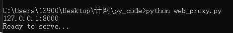
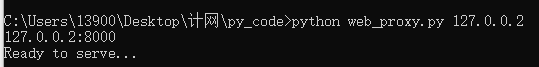
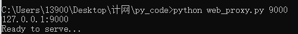
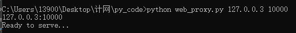

# Lab Assignment 1: **Multi-Threaded HTTP Web Proxy**

11810203 向羽

## Design ideas

### 1. read_command

First, we need to get the proxy sever's ip and port from command line. The default ip and port here is '127.0.0.1' and 8000. (my port 8080 has been used so I change the default value)

```python
def read_command():
    IP = '127.0.0.1'
    PORT = 8000
    # read input from command line
    if len(sys.argv) == 2:
        if sys.argv[1].isdigit():
            PORT = int(sys.argv[1])
            # print("PORT:%d"%PORT)
        elif len(sys.argv[1].split('.')) == 4:
            IP = sys.argv[1]
            # print('IP:%s'%IP)
    elif len(sys.argv) == 3:
        if sys.argv[2].isdigit():
            PORT = int(sys.argv[2])
            # print("PORT:%d"%PORT)
        if len(sys.argv[1].split('.')) == 4:
            IP = sys.argv[1]
            # print('IP:%s'%IP)
        else:
            print("wrong input!")
    elif len(sys.argv)>3:
        print("wrong input!")
    return IP, PORT
    # print("%s:%d" % (IP, PORT))
```

### 2. sever

Create the thread of sever and accept the client connect.

```python
def sever(tcpSerSock):
    while 1:
        # Strat receiving data from the client
        print('Ready to serve...')
        tcpCliSock, addr = tcpSerSock.accept()
        print('Received a connection from:', addr)
        thread_sever = threading.Thread(target=proxy(tcpCliSock))
        thread_sever.setDaemon(True)
        thread_sever.start()
        # Proxy the request from the clinet

```

### 3. proxy

1. Build a cache. 

   Use .txt to store the response form target sever. The name of .txt is the request form client. So we can use `cache_list = os.listdir(path)` to search the cache. If cache_list cannot find it, the write the request and response in the txt. If cache hits, the proxy sever will `print("Read From Cache")`. After that, the proxy will send the request to target with the original message add If-Modified-Since: GMT_now. If the response is 200 which means the response is different from we saved one, we rewrite the txt and send the new response. If the response is 304, we just send the old one.

2. Find the target ip and port. 

   The hostname is in the request form client. We can use `getaddrinfo(host_read, 'http')` to find 

   the ip and port. However, some hosts have two ip, one is  IPV6, another is IPV4. In my test, I found the IPV4 address is at the last of list. 

3.  Thread lock

   For every write method, I set a lock here, only one thread can do write option before lock release.

```python
def proxy(tcpCliSock):
    data = tcpCliSock.recv(4096)
    # print(data)
    request_type = data.decode().split(" ")[0]
    # check cache
    path = r'cache/'
    cache_list = os.listdir(path)
    # print(cache_list)
    data_cache = data.decode().split("\r\n")[0].replace(".","_").replace("/","_").replace(":","_") + ".txt"
    # print(data_cache)
    if data_cache in cache_list:
        print("Read From Cache")
        host_read = data.decode().split("Host:")[1].split(" ")[1].split("\r")[0]
        # 有的网页支持IPV6，所以会返回两组数据，后面一个是IPV4
        temp = len(getaddrinfo(host_read, 'http'))
        source_ip = getaddrinfo(host_read, 'http')[temp - 1][4][0]
        print(source_ip)
        # print(getaddrinfo(url_read, None))
        if getaddrinfo(host_read, 'http')[temp - 1][4][1] is not None:
            source_port = getaddrinfo(host_read, 'http')[temp - 1][4][1]
        else:
            source_port = 80

        target = socket(AF_INET, SOCK_STREAM)
        target.connect((source_ip, source_port))
        GMT_FORMAT = '%a, %d %b %Y %H:%M:%S GMT'
        gmt_modify = bytes(datetime.datetime.utcnow().strftime(GMT_FORMAT),'utf-8')
        data = data.decode().split("\r\n\r\n")[0].encode() \
               + bytes("\r\nIf-Modified-Since: ",'utf-8') \
               + gmt_modify+bytes("\r\n\r\n",'utf-8')
        print(data)
        target.sendall(data)
        data_source = target.recv(4096).decode()
        #print(data_source)
        print(data_source.split(" ")[1])
        if data_source.split(" ")[1]=='304':
            print("not changed")
        elif data_source.split(" ")[1]=='200':
            if mu.acquire(True):
                with open(path+data_cache,'w') as f:
                    f.write(data_source)
                    # print("change")
                    mu.release()
        # print(path+data_cache)
        f = open(path+data_cache)
        cache_read = f.read().replace("\n\n","\r\n").encode()
        print(cache_read)
        tcpCliSock.sendall(cache_read)
        f.close()
        tcpCliSock.close()
    # print(os.listdir(path))
    # ['test1.txt', 'test2.txt']
    else:
        if data and data != b'exit\r\n':
            # 解析host,找到目标服务器的IP 和 PORT
            # print(data)
            host_read = data.decode().split("Host:")[1].split(" ")[1].split("\r")[0]

            # 有的网页支持IPV6，所以会返回两组数据，后面一个是IPV4
            temp = len(getaddrinfo(host_read, 'http'))
            source_ip = getaddrinfo(host_read, 'http')[temp - 1][4][0]
            print(source_ip)
            # print(getaddrinfo(url_read, None))
            if getaddrinfo(host_read, 'http')[temp - 1][4][1] is not None:
                source_port = getaddrinfo(host_read, 'http')[temp - 1][4][1]
            else:
                source_port = 80

            target = socket(AF_INET, SOCK_STREAM)
            target.connect((source_ip, source_port))
            target.sendall(data)
            # print(data)
            data_source = target.recv(4096)
            # print(data_source)
            tcpCliSock.sendall(data_source)
            data_cache = data.decode().split("\r\n")[0].replace(".","_").replace("/","_").replace(":","_") + ".txt"
            if mu.acquire(True):
                with open(path + data_cache,"w") as f:
                    f.write(data_source.decode())
                    mu.release()
            # print(data_source)
            # print('{} sent: {}'.format(addr, data))
            target.close()
            # print('url is : {}'.format(url_read))
        # Fill in end.
        else:
            print("recieve data is wrong")
        tcpCliSock.close()
```

### 4. main

In this part, combine the parts before , create thread lock and multi-threaded object  

```python
if __name__ == '__main__':
    IP, PORT = read_command()
    # Create a server socket, bind it to a port and start listening
    tcpSerSock = socket(AF_INET, SOCK_STREAM)
    mu = threading.Lock() # 创建线程锁
    try:
        # Fill in start.
        tcpSerSock.bind((IP, PORT))
        tcpSerSock.listen(10)
        thread_main = threading.Thread(target=sever(tcpSerSock))
        thread_main.setDaemon(True)
        thread_main.start()

    except KeyboardInterrupt:
        print("proxy sever exit")
    finally:
        tcpSerSock.close()
```


## Test methods

## **1. Proxy GET and HEAD Request (60 points)**

Run the web proxy server in one command prompt, four methods are ok. Here I print the ip and port to ensure the arguments is readed.

```
python web_proxy.py
```



```
python web_proxy.py 127.0.0.2
```



```
python web_proxy.py 9000
```



```
python web_proxy.py 127.0.0.3 10000
```



